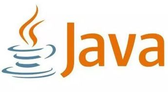
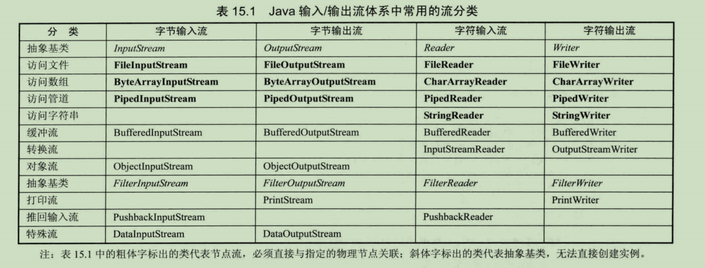

# Crazy_Java 自学教程 (基于实例)

**本仓库是我为了系统的复习JavaSE 于2019.9
建立的。有意整理成教程，供自己复习和他人学习。**

*参考自 《疯狂java讲义》 《Head_First_Java》 以及 IT黑马、渡一教育的部分培训视频*

* **小提示：**

* **====本教程第一部分是《Head_First_Java》阅读笔记，第二部分是实例源代码。**
* **====知识点是在编写实例的同时记录的，主要以Java源码的形式呈现。**

* **====包含了反射和注解的知识，有利于更好的理解Spring框架的IOC，DI等思想。**

---

---

Java基础知识学习的过程，也是我熟悉IDEA 熟悉编程规范，熟悉MarkDown 熟悉Git GitHub的过程。  
所以本仓库不完美，但我会努力做到尽善尽美。希望读者见谅和指正。

## 传送门：

### Java入门( 我的 《Head_First_Java》 笔记 )
注：此读书笔记仅仅是读书笔记而已。

##### [一：Java基本概念](src/HeadFirstJava读书笔记/一：基本概念.md)
 
##### [二：类与对象](二：类与对象.md) 

##### [三：原始的主数据类型和引用](src/HeadFirstJava读书笔记/三：原始的主数据类型和引用.md)
##### [四：方法操作实例变量](src/HeadFirstJava读书笔记/四：方法操作实例变量.md)
 
##### [五：继承和多态](src/HeadFirstJava读书笔记/五：继承和多态.md)
##### [六：接口与抽象类（深入多态）](src/HeadFirstJava读书笔记/六：接口和抽象类(深入多态).md)
##### [七：对象的前世今生（构造器与垃圾收集器）](七：对象的前世今生（构造器与垃圾收集器）.md)
##### [八：异常处理](src/HeadFirstJava读书笔记/八：异常处理.md)
 
##### [九：序列化(serialization)、IO：保存对象](src/HeadFirstJava读书笔记/九：序列化(serialization)、IO：保存对象.md) 

##### [十：网络编程与线程](src/HeadFirstJava读书笔记/十：网络与线程.md)
##### [十一：集合与泛型](src/HeadFirstJava读书笔记/十一：集合与泛型.md)

#### [下载《Head_First_Java 学习笔记》*进入后点击：view raw* ](【笔记】【Head_First_Java】.docx)

---
### **下面开始结合实例进行系统的学习。**
### 集合框架类

#####  Collection（List Queue Set）

[迭代器Iterator:](src/集合框架类Test/Collection/Iterator_foreach_Test.java)  

###### List
    
 [**List接口简介**](src/集合框架类Test/Collection/List/List)   
 
 [**ArrayList** ](src/集合框架类Test/Collection/List/List_Test.javat)   
 
 [**ArrayList和Vector**](src/集合框架类Test/Collection/List/ArrayList和Vector/ArrayList和Vector)  
 
 [**LinkedList**](src/集合框架类Test/Collection/List/LinkedList/LinkedList_Test)  
 
 [**LIst_Iterator的使用**](src/集合框架类Test/Collection/List/ListIterator_Test.java)   
 * [**线性表的性能分析**](src/集合框架类Test/Collection/List/线性表的性能分析)  

###### Queue

[**Queue队列接口简介**](src/集合框架类Test/Collection/Queue/Queue队列)  
[**Queue的实现类** *PriorityQueue*]( src/集合框架类Test/Collection/Queue/PriorityQueue_Test.java) 

双端队列：Deque  
[**Deque模拟数据结构-队列**](src/集合框架类Test/Collection/Queue/Deque/ArrayDeque_Queue_Test.java)  
[**Deque模拟数据结构-栈**](src/集合框架类Test/Collection/Queue/Deque/ArrayDeque_Stack_Test.java)  

###### Set

[**Set接口简介** ](src/集合框架类Test/Collection/Set/Set) 

[**HashSet** ](src/集合框架类Test/Collection/Set/HashSet/HashSet_Test.java) 

[ **LinkedHashSet** ](src/集合框架类Test/Collection/Set/HashSet/LinkedHashSet/LinkedHashSet_Test.java) 
 
[**TreeSet**](src/集合框架类Test/Collection/Set/SortedSet接口/TreeSet)  

[**EnumSet**](src/集合框架类Test/Collection/Set/EnumSet)  

##### Map

[Map接口简介](src/集合框架类Test/Map/Map接口)

 [**HashMap**](src/集合框架类Test/Map/Map_Test.java)

[ **identityHashMap**](src/集合框架类Test/Map/HashMap和Hashtable/IdentityHashM/IdentityHashMap_Test.java) 

[**LinkedHashMap** ](src/集合框架类Test/Map/HashMap和Hashtable/LinkedHashMap/LinkedHashMap_Test.java) 

[**WeakHashMap**](src/集合框架类Test/Map/HashMap和Hashtable/WeakHashMap/WeakHashMap_Test.java) 

[**什么是Hashtable，HashMap和Hashtable的区别** ](src/集合框架类Test/Map/HashMap和Hashtable/HashMap和Hashtable) 

[**Properties** *Hashtable的子类*](src/集合框架类Test/Map/HashMap和Hashtable/Properties/Properties_Test.java)

 [**TreeMap：** *SortedMap接口实现类*](src/集合框架类Test/Map/SortedMap接口/TreeMap/TreeMap_Test.java)  

[**EnumMap**](src/集合框架类Test/Map/EnumMap/EnumMap_Test.java)  
  

##### Collections工具类

[**collections工具类**](src/集合框架类Test/Collections/Collections工具类) 

[**简单的扑克游戏**](src/集合框架类Test/Collections/一个简单的扑克牌游戏) 

[**Collections_Search**](src/集合框架类Test/Collections/Collections_SearchTest.java) 

[**Synchronized**](src/集合框架类Test/Collections/Synchronized_Test.java) 

##### 古老的Enumeration类

[**Enumeration**](src/集合框架类Test/古老的Enumeration类/Enumeration)  

[**Enumeration_Test**](src/集合框架类Test/古老的Enumeration类/Enumeration_Test.java)  

* [***HashSet和HashMap的性能分析***](src/集合框架类Test/HashSet和HashMap的性能分析) 

### [***单元测试 Junit***](src/单元测试Test)

### JDBC编程  *（Mysql）*

[JDBC简介](src/JDBC编程_MySql/JDBC)

[连接数据库：IT黑马](src/JDBC编程_MySql/ConnMySQL_CrazyJava.java)

[连接数据库：疯狂java讲义](src/JDBC编程_MySql/ConnMySql_itheima.java)

[**DDL操作:** *数据库的定义, 与数据库/表结构: create, drop, alter*](src/JDBC编程_MySql/Execute/ExecuteDDL.java)  

[**DML操作:** *数据操纵语言: 操作表数据 insert update delete*](src/JDBC编程_MySql/Execute/ExecuteDML.java)  

[**不清楚Sql语句的类型时的操作**](src/JDBC编程_MySql/Execute/ExecuteSQL.java)

[**ResultSet 实现可更新，可改变的结果集** ](src/JDBC编程_MySql/ResultSet/ResultSet_Test.java)

[**JDBC调用存储过程** *（涉及数据库知识）*](src/JDBC编程_MySql/Statement/CallableStatement_Test.java)

[**更好的Statement：** *PreparedStatement*](src/JDBC编程_MySql/Statement/PreparedStatement_Test.java)

[**向数据库中存储图像  使用数据库的Blob类型**](src/JDBC编程_MySql/Blob类型的操作_存储图片或者声音文件/BlobTest.java)

### 异常处理

[**异常处理简介** *大多数异常处理知识点都在这里*](src/异常处理/异常处理)

[**try语句 的自动关闭资源功能**](src/异常处理/AutoCloseTest.java)

[**throws**](src/异常处理/ThrowsTest.java)

### 泛型

[**泛型介绍**](src/泛型/泛型基础)

[三个小例子](src/泛型)

### IO流 

[**File类** *文件路径对象*](src/IO流.File.FileDemo.java)  

[**标准输入输出流:** *in out*](src/IO流/System/SystemIn_OutputStreamWriter.java)  

[**文件字节流：FileInputStream FileOutputStream：**](src/IO流/FileIn_OutputStream/FileIn_OutputStream_CopyTest.java)  

[**文件字符流：FileReader FileWriter：**](src/IO流/FileReaderWriter)

[**缓冲流：Buffered Stream** *（包含文件复制、File和Arrayl互相转换）：*](src/IO流/BufferedStream) 

[**转换流：InputStreamReader/InputStreamWriter**](src/IO流/System/InputStreamReader_Test.java) 

[**对象输入输出流：ObjectInputStream ObjectOutputStream：**](src/IO流/Object_InOut_Stream)

[**打印流：PrintWriter：**](src/IO流/PrintWriter/PrintWriter_Test.java)

[**同IO流结合的Properties：**](src/IO流/Properties/Properties.java)

[**推回输入流:** *PushBack*](src/IO流/PushBack/PushBackTest.java)  

* [**如何解决乱码问题？** *码表的相关知识：*](src/IO流/Encode/EncodeDemo.java)  

### 多线程

[**实现方式1：类继承Thread ，成为线程类**](src/多线程_IT黑马/Test1)
 

[**实现方式2：创建实现Runnable接口的类，Thread(Runnable target)**](src/多线程_IT黑马/Test2)

* [**线程的生命周期：** *wait（）notify()*](src/多线程_IT黑马/线程的生命周期)

### 网络编程

 [ **IP地址类 InetAddress**](src/网络编程_IT黑马/InetAddressDemo.java) 
 
[**UDP Demo1**](src/网络编程_IT黑马/UDP/Demo1)
 
[**UDP Demo2**](src/网络编程_IT黑马/UDP/Demo2)
 
[**TCP Demo**](src/网络编程_IT黑马/TCP/Demo)
 
[**TCP 实例：请求更改大小写**](src/网络编程_IT黑马/TCP/实例1_请求更改大小写)
 
[**TCP 实例：模拟用户登录**](src/网络编程_IT黑马/TCP/实例2_模拟用户登录)

### 反射

[**反射介绍**](src/反射_渡一教育/底层的技术——反射.md)

[**根类加载器Bootstrap ClassLoader**](src/反射_渡一教育/BootstrapTest.java)

[**用反射操作 Class Field Package**](src/反射_渡一教育/ReflectDemo)   

[**用反射操作 Method Constructor**](src/反射_渡一教育/Method)

[***小应用：利用反射来改变String对象的值***](src/反射_渡一教育/ChangeStringValue.java)

* IOC（控制反转）和 DI（依赖注入）的例子。  
[**自己做的简单的Spring**](src/反射_渡一教育/IOC)

### 注解

[**注解简介（较之前的简介更为详细一些）**](src/注解_渡一教育/注解.md)

[**自定义一个注解** *并利用反射解析自己的注解，获得注解信息。*](src/注解_渡一教育/MySelfAnnotation)  

[**利用注解和反射实现_IOC 获取注解的信息进行依赖注入。**](src/注解_渡一教育/利用注解和反射实现_IOC)

---

#### **暂时结束java基础 学习！ 我们 ~~江湖~~ web基础 和 数据库 再见！！**  

---

关于路径中的符号：/ 和 /：
    
    UNIX 操作系统设计了这种路径分隔法，它使用反斜杠：/。
    由于网络是首先应用在 UNIX 计算机之间的，至今为止，一半以上的网络服务器仍是使用UNIX 操作系统的，所以网址也沿用了反斜杠作路径分隔符。
    
    微软在开发 DOS 2.0 的时候，借鉴UNIX 中了这种目录结构，但由于 DOS 中，斜杠已经用来作为命令行参数的标志了（UNIX 中用的是“ - ”符），所以只得使用反斜杠："/"
    
    Windows 时代，很多时候已经没有命令行参数的干扰，加上网络使用的扩展，
    文件夹路径的斜杠和反斜杠大多时候可以互换，是没有什么影响的;
    但浏览器中斜杠就不能互换的原因在于:当今有一半以上的网络服务器仍是使用UNIX 操作系统;必须使用：反斜杠："/" 