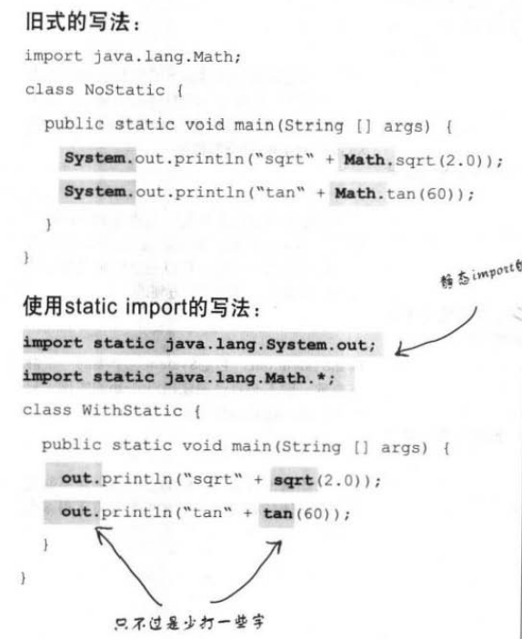

2019.6
## 七：对象的前世今生构（造器与垃圾收集器）

**本章讨论对象如何创建，存在于何处以及如何让保存和抛弃更有效率。堆，栈，范围，构造器，空引用。**
	
	

### 堆与栈：生存空间
当Java虚拟机启动，会从底层操作系统取得一块内存块（我无法控制也不需在乎） 
  
   - 堆<heap>：存对象
   - 栈<stack>：存方法和局部变量（又称栈变量）。  
   
实例变量存在于所属对象中，对象在堆上，实例变量若是个对对象的引用，它是存在于该对象中。  

·#  栈是啥？  
栈就是一个桶。后进先出。（堆栈，就是栈。是之前的叫法。）读到一个方法（连同其局部变量）就放入栈中，栈顶是目前正在执行的方法。  
·# 堆是啥？  
就是个存储空间，以完全二叉树存储，方便进行堆排序，查找数据很快。  
·# 为何要知道栈与堆得机制？  
	*可以了解变量的有效范围(scope)，对象的建立，内存管理，线程(thread)和异常处理。*  
	
### 成员变量，实例变量，类变量（静态变量）局部变量

##### 成员变量：类中方法外定义的

1.	实例成员变量（实例变量）：  
	方法外类中正常定义的 int I; 存在于所属对象中。（实例变量可以是对象的引用 … = new… ）  
2.	类变量（静态变量）：  
Static修饰的。一处改变，处处改变。生存期为整个源程序。若在函数中，只能在函数内使用，出了函数，尽管还存在 但不能使用。	  

##### 局部变量：方法体中定义的变量。

- 构造方法和类同名！且没有返回类型。构造方法不会被继承。
- 类方法前面有static修饰，而实例方法没有。
- 实例方法既能对类变量操作，也能对实例变量操作，而类方法只能对类变量进行操作。

### 构造方法，类方法，实例方法的区别
构造函数执行时，第一时间会执行父类的构造函数。（抽象类也有构造函数。每个类都至少有一个）

### 创建对象
- `New Dog(); `是在调用Dog的构造方法  
- 构造方法看起来像方法，但不是方法。这段代码会在初始一个对象时使用。唯一能调用构造方法的方式就是新建一个对象。  
- 注意使用含参的构造方法。  
- 存在有参的构造方法，且需要无参的构造方法时，要自己写一个。 此时编译器不会自动帮我写出。  

### 调用父类构造函数
- 如果任意一个类没有手写构造函数，编译器自动帮写构造函数：  
	`Public ClassName(	) {	
	super();	}`  
- 如果子类有构造函数但是没有调用Super()：  
	- 当父类有无参的构造时，自动（隐式）调用父类无参的构造方法。
    - 当父类没有无参的构造时，子类只能显式调用父类有参的构造方法。Super( 参数 )  
由此保证了，执行构造方法，必先执行其父类的构造方法。栈！  

*注意，super() 的调用必须放在构造方法的首句。不然ide没等运行直接报错，*

### This() 
使用this（）从某一构造函数调用同一个类的另外一个构造函数（重载版的构造函数）v   
This只能用在构造函数中，且必须是第一条，super（）与this（）不兼得。    

### GC（垃圾收集器） 
 当最后一个引用消失，便再也无法取得对象的引用。对象就被回收。

### 数字与静态 

#### Math 
- 最接近全局的方法。这个类中的所有方法都不需要实例变量。方法都是静态的。
- 这些方法无需实例变量，因此也不需要特定对象来判别行为。直接用类名调用方法！
- Math.round(42.2) 返回参数四舍五入之后的整形或者长整形。
- Math.random() 返回介于0.0~1.0之间的双精度浮点数。
- Math.abs() 返回绝对值。传入整型返回整型，传入双精度返回双精度（此方法有重载）
- Math.min(); math.max; 也都有重载版本。可返回整型或双精度。

#### Static
- 关键词标记出不需要类实例（对象）的方法。静态方法时一种不依靠实例变量也就不需要对象的行为。直接用类名来调用，标记构造函数为private 这样就无法创造类的实例（Math就是这样）
- 静态的方法不能调用非静态的变量/方法。（因为他不知道可以使用哪个实例变量。）
- 静态变量值对所有的实例共享（对所有的实例都相同）
- 实例变量：每个实例一个，静态变量：每个类一个。
- 静态变量会在该类的任何对象创建之前就完成初始化
	- 会在该类的任何静态方法执行前就初始化。
	- 若没有给静态变量赋初值，会自动设置默认值。同实例变量。
#### Final
- 静态的final变量是常数（命名首字母大写）。即类加载之后，静态final变量就会一直维持原值。
- Final修饰的变量（实例，局部，方法参数）代表了值不能动。
- Final可以阻止方法的覆盖或者类的继承。
- 类标记final之后，就不必多此一举给方法标记final了。因为不能继承就肯定没有重写这一说。】

#### 主数据类型的包装类
当需要以对象方式来处理主数据类型，就把他们包装起来。

`Int i = 200;`  
`Integer inte =new Integer(i); 包装`  
`Int uninte = inte.intValue();解开包装。`  

java5.0之后有 autoboxing功能，自动包装。  
`ArrayList<Integer> list = new ArrayList<Integer>();`  
`List.add(3);`   
可以直接把整型3 加入ArrayList，没有add(int)，但编译器自动包装成Integer类型。  
`Int  num = list.ger(0)`   
可以自动解开Integer对象的包装，因此可以直接把Integer赋值给int 

- `ArrayList<int>`将无法通过编译。
- Autoboxing 参数/返回值 是包装类型，可以传入/出相应的主数据类型，反之亦然。
- 布尔表达式或是boolean包装类型的引用可以放在预期boolean值的位置。
    - 可以对包装类进行数值运算 
    - 可以在包装类和主数据之间相互赋值运算。
- 包装类可以将String 转换成相应的数值。
    - `Integer.parseInt(“12313123”);`
    - `Double d = 4.25;`
    - `String doubleString = “”+ d; `   
    //“+”这个操作符是java中唯一有重载过的运算符

#### 数字（日期）的格式化
- `String s = String.format(“%,d”,10000000); `  
输出的是有逗号的数字格式（美式数字）完全同C的print  
- 格式化输出日期：  
    - 完整的日期与时间：`%tc`  
    - `String .format(“%tc”,new Date() );`   
    - 只有时间：`%tr ` 
    - `String.format(“%tr”,new Date() );`  
    - 周、月、日: `%tA %tB %td  `  
  
  因为没有刚好符合我们要求的输出格式,所以得组合3种形式来产生出所需要的格式:  
    - `Date today =new Date ();`这样就得把Data时象借进去3次字符串。  
    - `String.format (“%tA, %tB, %td”，today, today, today);`這里的逗号号是直提給出的,星期天,11月28日  

- 操作日期  
    - `Java.util.Date `适合用来取得当前的时间，但是很多功能转移到了下面的类  
    - `Java.util.Calendar  `
    - Calendar是个抽象类，无法取得Calendar的实例，但是可以取得其子类的实例  
    - 要这样才能取得Calendar实例：  
    - `Calendar cal = Calendar.getInstance(); `返回一个具体子类的实例。会依照合约来响应Calendar应有的方法。大部分Java版本会默认返回一个Java.util.GregorianCalendar的实例。  
    - 可以不受限制的调用Calendar的静态方法。静态方法时在类上的，而不是具体的实例上的。
 
具体查看calender api

   
 但是会让程序更容易混淆。让程序少打一些字。
