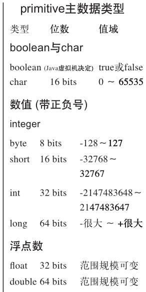
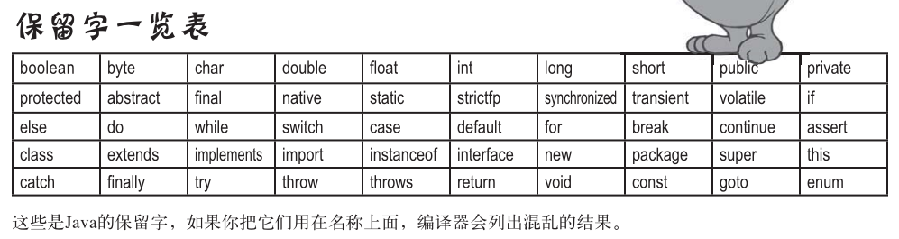
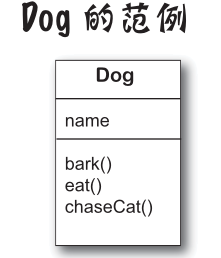
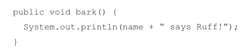

2019.6

## 三：原始的主数据类型和引用
- 【1】变量必须拥有类型variables must have a type，变量必须拥有名称variables must have a name
- 【2】类型与类是相通的同义字。  
  
- 【3】float的数必须加上f，否则所有带小数点的数都会被Java当成double处理。
- 【4】关键字：必须以字母 _ $ 开头，不可用数字。   
  
- 【5】对象只会存在可回收垃圾的堆上。
- 【6】没有对象变量这种东西的存在。只有引用到对象的变量。  
    - 如： `Dog d = new Dog();` d就是引用到对象的变量。  
    - 他不是对象的容器，是类似指向对象的指针。在Java中我们不会也不该知道引用变量中实际装载的是什么，它只是用来代表单一的对象。只有Java虚拟机才会知道如何使用引用来取得该对象。
- 【7】 `Dog myDog = new Dog();`  
	- Dog myDog 声明了一个引用变量。  
	- New Dog() 创建对象，要求java虚拟机分配堆空间给新建立的Dog对象。（9章详细讨论）  
	- "=" 将新的Dog对象 赋值给myDog 这个引用变量。 
    - 不能对引用变量进行运算（Java不是C）  
    - Dog型的引用变量可以引用某个Dog对象 ，然后一会儿又去引用另外一个Dog 只要是Dog就行。但是被标记成Final的话，一旦被指派给某个Dog之后，就不能赋值给这个特定Dog之外的任何事物，被固定下来了。引用变量可以是空指针，null，但没意义。
- 【8】`Book a = new Book();  Book b = new Book();`  
    Book c = b;   c与b引用到了同一个对象。
    当某个对象没有了引用，变成无法存取的,被回收。而引用变量不再引用任何对象时，是null 还可以引用其他同类型的对象，不会被回收。
- 【9】 `nums = new int [7];`   
    - 数组是对象。JAVA的标准库函数包含许多复杂的数据结构，map，tree，set 。快速有序有效率的排列元素的时候，数组是很好的选择。数组可以使用位置索引来快速、随机的取元素。
    - 数组中可以放八大数据类型或者引用。Dog[ ]中的元素是引用变量，只能保存指向对象的引用而不是对象。
    - 记住，数组可以有主数据类型的元素，但数组本身绝对不会是主数据类型。不管数组带有什么，他一定是对象。
- 【10】  
`Dog [ ] pets ; `   声明数组变量,只有数组变量才能接受数组。  
`Pets = new Dog[7];  ` 创建大小为7的数组，赋值给变量  
   ` Pets[1]=new Dog();  Pets[2]=new Dog();`  
    对象数组的操作不需要变量名称，数组索引就可以操作特定的数组对象了。  
 `   Dog[ ] myDog = new Dog[7];`  
    只有数组变量才能接受数组。编程一定要保证对应关系！！！！！

- 【11】一个对象，由变量和方法组成。   
   
    - Bark方法中的name变量就是调用bark方法的特定Dog对象拥有的特定的name。
变量有两种，主数据类型和引用
