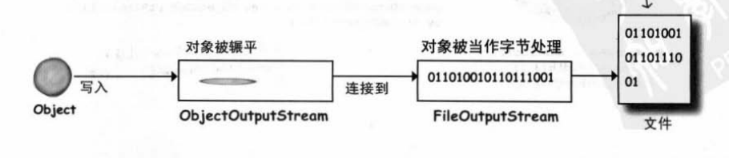
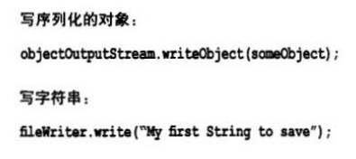
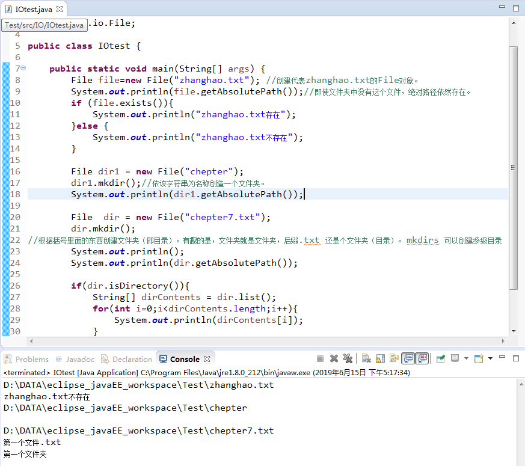
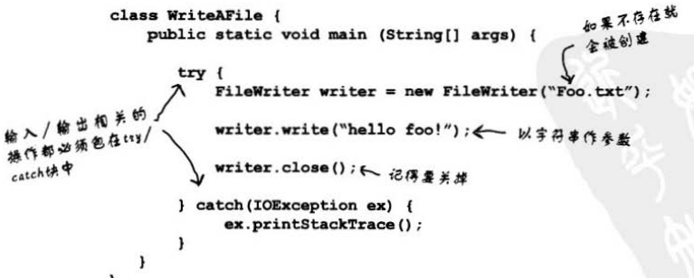

2019.6

## 九：序列化(serialization)、IO：保存对象
不涉及数据库
- 【1】	将对象序列化（存储）
    - a)	创建 FileOutputStream对象
    - b)	上一步对象能让我写入对象，但无法直接连接文件，需要参数的指引。
        - 	创建ObjectOutputStream。 New时的参数是上面的对象。
    - c)	写入对象
        - 	Os.writeObject(…..);
    - d)	关闭ObjectOutputStream 
        - 	Os.close();
        
- 【2】	ObjectOutPutStream.writrObject(ss) 任何放在这个括号里面的对象都要序列化否则在执行期会出问题。 
    - a)	序列化只需要让类 implements Serialization （没有方法需要被实现，只是用来告诉Java虚拟机它可以被序列化。）
    - b)	序列化是全有或者全无的，不能部分序列化。
    - c)	如果需要序列化的程序能跳过某个实例变量，就标记成transient的变量。
    - d)	静态变量不会被序列化。因为static代表每个类一个。而不是每个对象一个。
- 【3】	通过序列化存储对象的状态。
- 【4】	使用ObjectOutputStream来序列化对象(java.io)
- 【5】
- 【6】	链接串流用来衔接连接串流
- 【7】	用FileOutputStream链接ObjectOutputStream来将对象序列化到文件上。
- 【8】	调用ObjectOutputStream的writeObject(theObject)来将对象序列化，而不需要调用FileOutputStream的方法。
- 【9】	对象必须实现要序列化的序列化接口。如果父类实现序列化，则不管是否有明确的声明，子类都会自动实现。
- 【10】	当对象序列化时，将序列化整个对象。这意味着它的实例变量所引用的对象也被序列化。
- 【11】	如果存在无法序列化的对象，则会在执行期间抛出异常
- 【12】	除非实例变量被标记为transient，否则在恢复时，它会被赋null或主基本数据类型的默认值。
- 【13】	解序列化（deserialization）时，所有类必须对Java虚拟机可用
- 【14】	读取对象的顺序必须与写入对象的顺序相同。
- 【15】	readObject0的返回类型是Object，因此需要将解序列化的对象转换为其原始类型。
- 【16】	静态变量不会序列化，因为所有对象共享相同的静态变量值。序列化是对对象的序列化。

#### 字符串写入文本文件  
     	Servlet(在Web服务器上执行的Java程序)  
     	写入文本类似写入对象，使用FileWrite代替FileOutputStream（不会链接到ObjectOutputStream）

#### Java.io.File 
 File类代表磁盘上的文件（并不是文件本身，类似路径。他不能读取或者代表文件中的数据）   
 
 
实战操作是最好的老师！！！！！！！！
写的操作必须包含在Try/catch里面，否则编译器报错。很牛逼，很智能。

#### 缓冲区（好比超市的推车！！！）
每趟磁盘操作都比内存操作要花更多的时间，所以先存进缓冲区，满了之后一并写入目的地。  

`BufferedWriter writer = new BufferedWriter(new FileWriter(new File(“aFile”)));`  
可以直接调用FileWriter的Write（）来写到aField中，但是每次都直接写（拿一件商品付一次账）  
强制缓冲区立即写入，调用writer.flush();方法。  

#### 读取文本文件：
用FileReader来实际读取，用BufferedReader让读取更有效率。  
#### 写入文本文件  
  
 读或者写可以不手动创建File对象。因为File对象就相当于路径。
 
#### 解析字符串（用字符串中的特殊字符）

用String的Split()把字符串拆开，并返回String[ ];  
`String a=”sdafadf /dsafaf ”;`  
`String res = a.split(“/”);  ` 
