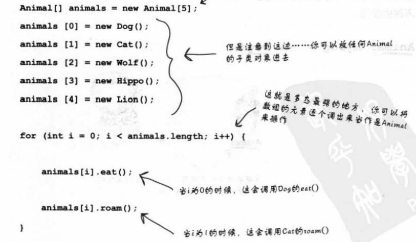

2019.6
## 五：继承与多态。
1.	类的成员包括：实例变量和方法。
2.	善于用继承来防止子类中出现重复的代码。所以编程之前的程序设计阶段尤为重要。
3.	当调用对象引用方法时，调用与该对象类型最接近的方法。Java虚拟机会从最低阶的类开始往上找。
4.	要找好 has-a 和 is-a 关系。所有子类应该通过上层父类的is-a测试。使用is-a检测合理性。
5.	父类是不能使用子类特有的方法的，就像遗传不能倒过来。
6.	通过super.方法名 让子类不完全覆盖父类的功能，只是额外加上行为。会先执行super版的方法，然后再回来执行sub版自定义的行为
7.	Public 被继承，private不被继承。 Private default protected public 限制程度依次减小。
8.	子类是extends父类出来的。继承下来的方法可以被覆盖，但是实例变量不能被覆盖。
9.	某方法在子类被覆盖过，调用方法时会调用覆盖过的版本。
10.	继承的好处：确保父型下所有类都有父型的全部方法。拟了一份合约。
11.	子类没有层数限制，但一般不会超过一到两层。
12.	除了内部类之外，没有私有类这个概念。三种方法让类不能继承：1：非公有的类只能被同一个包的类继承。2：用final标识类。Final是继承树的末端，不能被继承。3：让类只拥有private的构造方法。
13.	需要确保安全，确保方法都是我写的版本，就需要final。

#### 多态
多态下，引用与对象可以是不同的类型。
1. a)	Animal myDog = new Dog( );
1. b)	运用多态，引用类型可以是实际对象类型的父类。换句话说，任何extends过声明引用变量类型的对象都可以被赋值给这个引用变量。由此可做出多态数组等玩意。
   
   

1. c)	多态，顾名思义，就是多种样态。即同一个方法，参数是animal 类型，实参可以是dog、cat类型，由此触发不同子类的行为。这就是参数和返回值的多态！！！（将参数声明为父类类型，可以在运行时传入任何子类对象。）
1. d)	通过多态，引进新型的子类也不必修改程序。

#### 方法的重写（Overriding）：子类重写父类方法
1. a)	参数一样，返回类型要兼容（父类返回值类型或者其子类。）
1. b)	存取权限必须相同，或者更为开放。

#### 方法的重载（overload）：在一个类中讨论

1. 两个方法的名称相同，但参数不同。所以重载与多态毫无关系。  
1. 重载的条件是使用不同的参数，返回值类型自由定义。可以任意更改存取权限。
