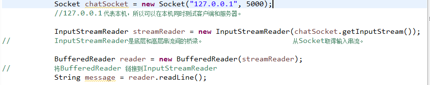

2019.6

## 十：网络编程与线程

要再看一下计算机网络的相关知识。
### 网络编程

#### 建立Socket连接
- Ip地址与端口号  他在那里以及用哪个端口与收发数据。
- Socket chatSocket = new Socket (“192.16.3.50”,5000);
- Socket连接的建立代表两台机器之间存有对方的信息，包括网络地址和Tcp的端口号。
#### 端口 
- 一个地址可以有65536个不同的端口号。
- 0~1023的Tcp端口是保留给已知的特定服务使用，我不能用
- 不同的程序不能共享一个端口。若使用（绑定）已被占用的端口，会收到 BindException。
- IP地址是门牌号码，端口号是该地址不同的工作窗口。
#### 读取Socket

#### 客户端代码：

#### 服务器端代码

上面的程序在没有完成用户的相应程序循环之前无法回到循环的开始来处理下一个请求。（accept）  
使用不同的~线程~并让新的客户端取得新的线程就好。  

- 【1】	客户端与服务器通过Socket连接来沟通。
- 【2】	Socket表示两个应用程序之间的连接，可能是在不同机器上执行。
- 【3】	客户端要知道服务器的ip（或网域名称）和端口号
- 【4】	Tcp端口号是个16位的值，用来指定特定的应用程序。
- 【5】	一旦建立了Socekt连接，客户端可以从socket取得底层串流。Sock.getInputStream();
- 【6】	建立BufferedReader链接InputStreamReader和来自Socket的输入串流来读取服务器的文本数据。
- 【7】	InputStreamReader是转换字节成字符的桥梁，用来链接BufferedReader与底层的Socket输入串流。
- 【8】	服务器可以使用ServerSocket来等待用户对特定端口的请求。
- 【9】	当ServerSocket接到请求时，它会做一个Socket连接（选取另一个端口做）来接受客户端的请求。

### 线程
` Thread t = new Thread();`  
`t.start();`  Thread类在Java.lang 包中（同System、 String ）

Thread 对象代表线程，当你需要启动新的线程时就建立Thread的实例。  
一个java程序代表一个线程（main在开始处），程序员负责启动自己建立的线程。  
Thread有启动、连接和让线程闲置等重要方法。	  
#### 如何启动新的线程。
- 1建立Runnable对象(线程的任务)
    - 	Runnable threadJob = new MyRunnable();
- 2建立Thread对象（执行工人）并复制Runnable（任务）
    - 	Thread myThread = new Thread （threadJob）;
    - 	告诉Thread对象要执行那个Runnable对象的run（）方法。
- 3 启动Thread 
    - myThread.start(); 
    - 没启动的话，什么也不会发生。在此之前myThread只是一个Thread的实例，并不是真正的线程。
- Runnable是一个接口！只有一个方法 public void run( );

- 【1】	一旦线程进入可执行状态，它会在可执行与执行中两种状态中来来去去，同时也有另外一种状态：暂时不可执行（又称 堵塞状态）
- 【2】	线程暂时被挡住：调度器会因为（如：执行到等待Socket输入串流的程度，但是没有数据可供读，调度器就会将其移出可执行状态。）线程的Sleep() ，或者线程调用某个被锁住（locked）的对象的方法。要等到锁住该对象的线程放开这个对象才能进行。
- 【3】	没有控制线程调度器的API 但是可以让某个线程Sleep 这可以保证在指定的时间内昏睡的线程一定不会被唤醒。
- 【4】	一旦Thread线程调用过run方法。该线程就不能重新启动。Thread对象可能还呆在堆上，如同活着的对象一样还能执行某些方法的调用，但是已经永远失去了现成的执行性，只剩下对象本身。
- 【5】	Java中的每个线程都有独立的执行空间
- 【6】	要把Runnable传给Thread的构造函数才能启动新的线程。
- 【7】	Run（）将会是新线程执行的第一项方法。
- 【8】	线程在初始化吼还没有调用Start() 之前处于新建立的状态。
- 【9】	调用Thread对象的Start（）之后，会建立出新的执行空间，他处于可执行状态等待被挑出来执行。
- 【10】	调度不能保证任何的执行时间和顺序！所以你不能期待它会完全的平均分配执行，你最多也只嗯呢该影响Sleep的最小保证时间。
- 【11】	Sleep()应包含着 try/catch中。可能抛出InterruptException s
- 【12】	可以创建两个线程，使用同一个任务。
- 【13】	利用setName()来给线程命名，帮助除错。
- 【14】	要判断好哪些指令不能被分割执行！使其同步化。
- 【15】	每个对象都有单一的锁单一的钥匙，只会在对象带有同步化方法时才有实际的用途

#### 并发性问题
1.数据安全问题。两个线程存取单一对象数据。2：更新丢失。 
- 使用synchronize（使同步）修饰方法使其每次只能被单一的线程存取。即 锁。
- 锁不是配在方法上，而是在对象上。保护对象的实例变量。
- 如果有多个方法可能操作对象的实例变量，则这些方法都应该有同步化的保护。
- 目的是保护数据，但锁的是方法。

因为同步化是有代价的，程序会变慢。甚至会导致死锁。  
被同步化了的代码块形成原子单位（不可分割） 不需要整个方法都同步化时，可同步部分代码块。  
可以 Synchronize (this ) {….} 来同步部分代码。只会使用参数所指定的对象的锁来做同步化。  
一般以当前对象来同步 this   
#### 死锁
两个线程互相持有对方正在等待的东西，一直等 等到海枯石烂。  
数据库或者其他服务器有事务回滚机制来复原不能全部完成的交易，而Java没有。  
Java没有处理死锁的机制，甚至不知道死锁的发生。  
