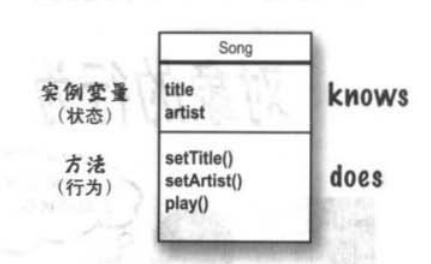

2019.6
## 四：方法操作实例变量
类时创造对象的蓝图。对象有状态和行为，即 实例变量和方法。方法会用到实例变量的值。
  
    
 
所以即使方法体一样，也可能出现不同的行为结果。  
- 【1】	方法只能声明单一的返回值，若要返回3个int 可以把返回值设为int 数组。如果有混合不同类型的值要返回时，可以考虑之后的ArrayList。
- 【2】	Setter 是给实例变量赋值，getter是返回实例变量的值。
- 【3】	封装：通过强制其他程序使用setter方法来设定变量而不是直接的用点（.）存取。我们可以编写方法体来保证数据的安全。需要值的时候调用get方法来取值。One.getSize()
    - 将实例变量标记为 private ，将getter与setter方法标记为public。
- 【4】	实例变量永远都会有默认值。整形：0 浮点型0.0 布尔型：false 引用类型：null
- 【5】	实例变量和局部变量的差别：
    - a)	实例变量生命在类中，局部变量声明在方法中。
    - b)	局部变量没有默认值，在使用前必须初始化，否则报错。
- 【6】 
	- 使用==比较两个主数据类型或者判断两个引用是否引用同一个对象
    - 使用equals（）来判断两个对象是否在意义上相等。 如两个String对象是否带有相同的字节组合
